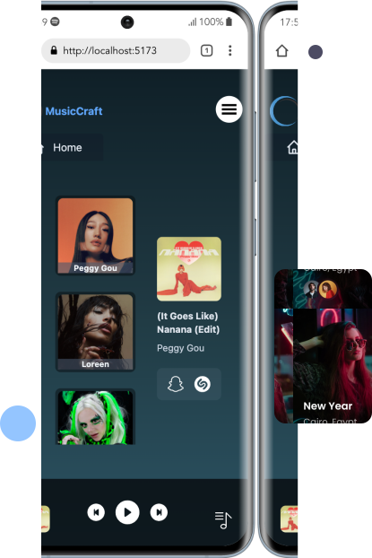

    

<h1 align="center" > Добро пожаловать в репозиторий MusicCraft! </h1>

Этот пет-проект представляет собой клиентскую часть приложения MusicCraft. Он предназначен для работы с запросами и изучения возможности Tailwind CSS.

За имитацию серверной части отвечает простой .json сервер. <a href='https://github.com/matyha345/jsonMusicCatalog'>jsonMusicCatalog </a>

Зависимости
Проект зависит от следующих внешних пакетов:

clsx
react
react-dom
react-icons
react-query
react-router-dom
react-select
swiper
Зависимости для разработки
Эти пакеты используются во время разработки:

@types/react
@types/react-dom
@vitejs/plugin-react
autoprefixer
axios
eslint
eslint-plugin-react
eslint-plugin-react-hooks
eslint-plugin-react-refresh
postcss
prettier
tailwindcss
vite

* Примеры 

 
 
 
 

* мобильная версия
 

* Видео пример 
 <video width="320" height="240" controls >
      <source src="./public/video/app-muz.mp4">
</video>

Автор:
* Имя: Nikolai Matiukhin
* <a href="https://telegram.im/@Muchakhos">Telegram</a>
* Электронная почта: matyha345@gmail.com