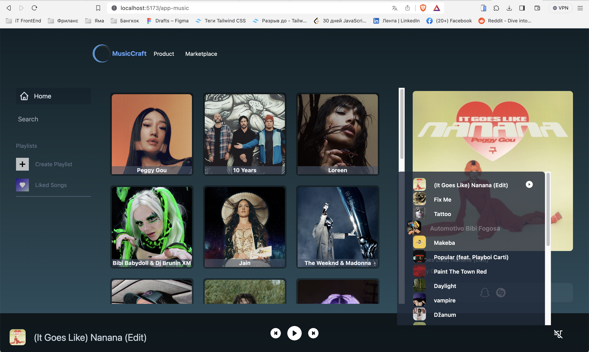
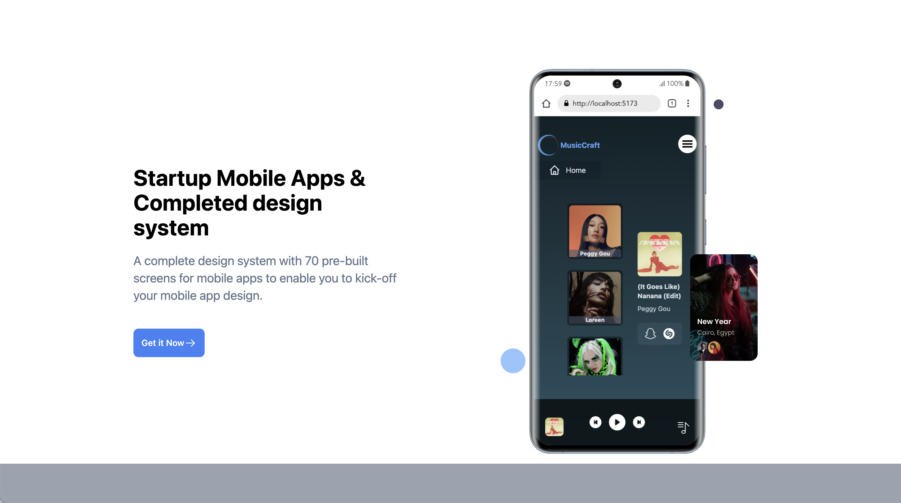
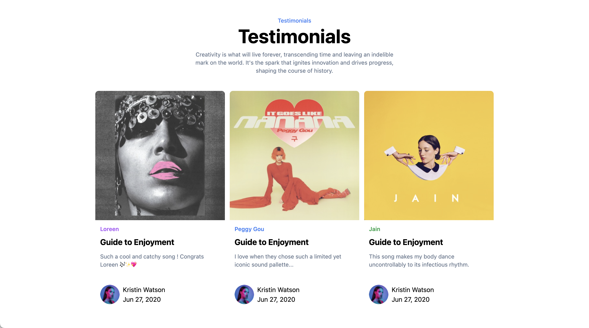
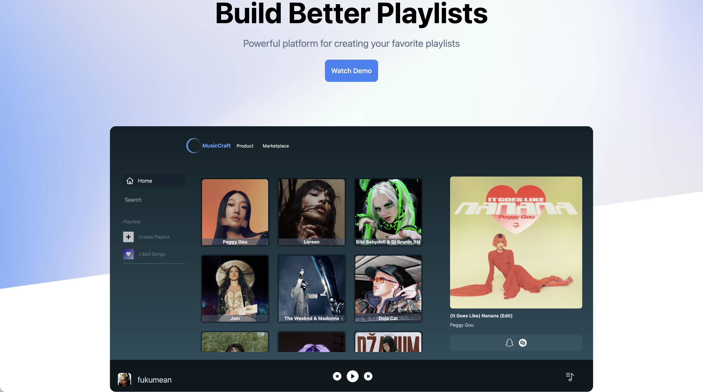
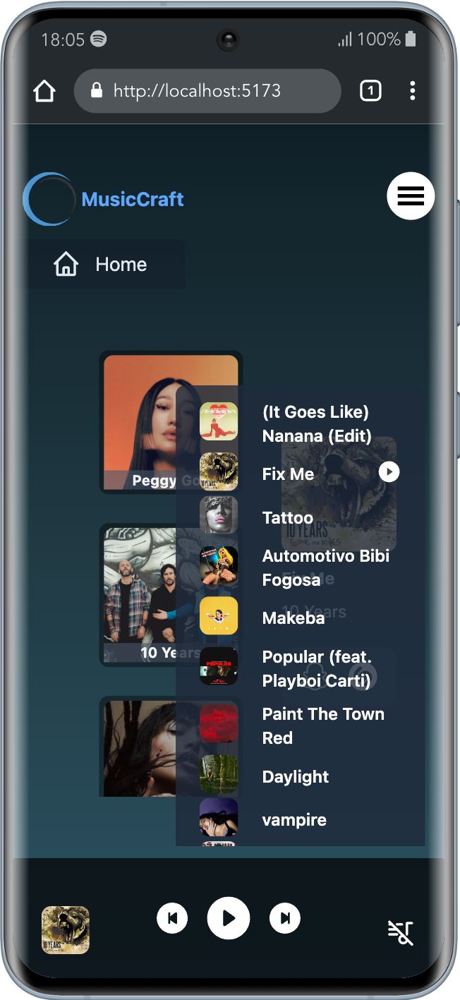
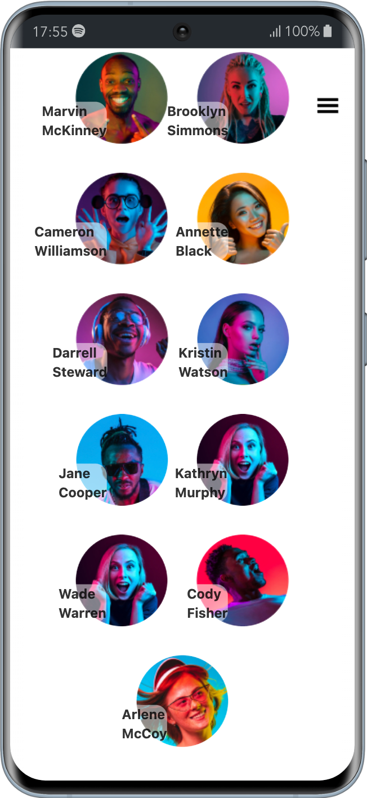
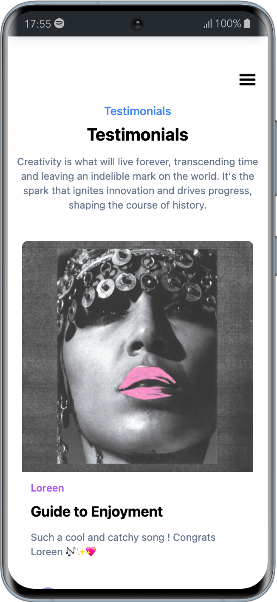
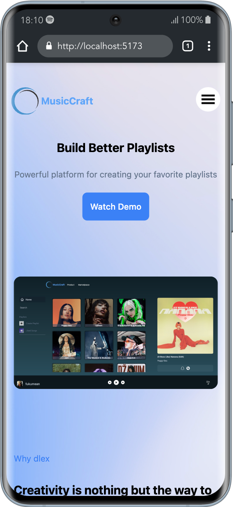

    

<h1>En</h1>
<h1 align="center" > Welcome to the MusicCraft repository! And this is it. </h1>

This pet project is a client-side part of the MusicCraft application. It is designed to handle requests and explore the capabilities of Tailwind CSS.

Simulating the server-side is a simple .json server called <a href='https://github.com/matyha345/jsonMusicCatalog'>jsonMusicCatalog </a>

#

<h1>Ru</h1>
<h1 align="center" > Добро пожаловать в репозиторий MusicCraft. </h1>

Этот пет-проект представляет собой клиентскую часть приложения MusicCraft. Он предназначен для работы с запросами и изучения возможности Tailwind CSS.

За имитацию серверной части отвечает простой .json сервер. <a href='https://github.com/matyha345/jsonMusicCatalog'>jsonMusicCatalog </a>

Зависимости || Dependencies

Проект зависит от следующих внешних пакетов: || The project relies on the following external packages:

clsx
react
react-dom
react-icons
react-query
react-router-dom
react-select
swiper

Зависимости для разработки || Development Dependencies

Эти пакеты используются во время разработки || These packages are used during development:

@types/react
@types/react-dom
@vitejs/plugin-react
autoprefixer
axios
eslint
eslint-plugin-react
eslint-plugin-react-hooks
eslint-plugin-react-refresh
postcss
prettier
tailwindcss
vite

#

* Примеры || Examples

#

 
 
 
 

#

* мобильная версия || Mobile Version

#

 
 
 
 
 

Автор || Author:
* Имя || Name: Nikolai Matiukhin
* <a href="https://telegram.im/@Muchakhos">Telegram</a>
* Электронная почта || Email: matyha345@gmail.com